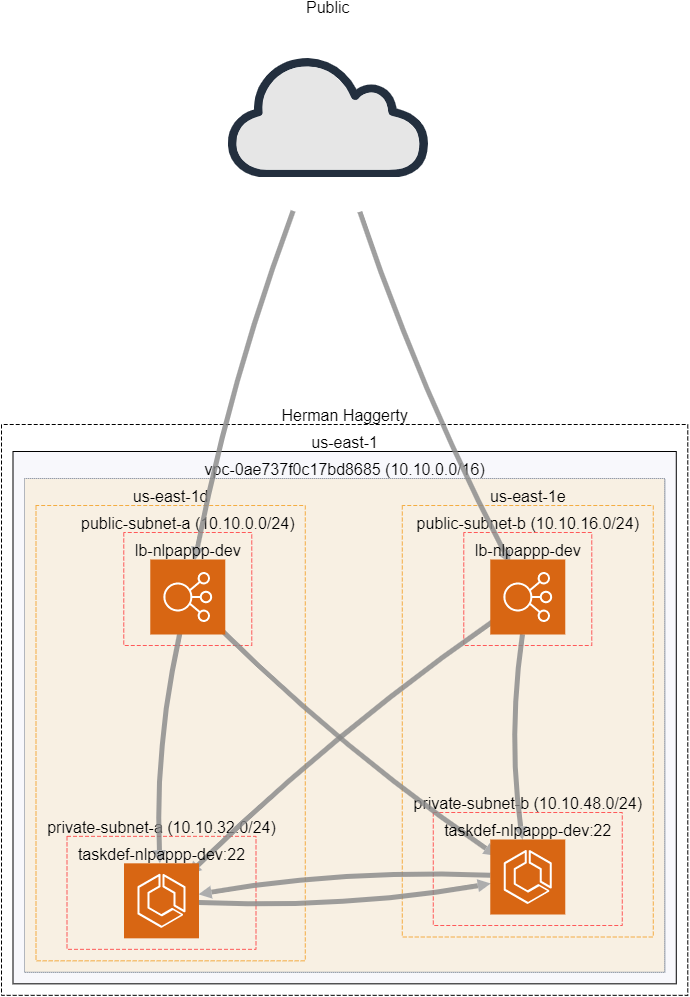

<div align="center">

<h3 align="center">MindProject</h3>

</div>


<!-- TABLE OF CONTENTS -->
<details>
  <summary>Table of Contents</summary>
  <ol>
    <li>
      <a href="#about-the-project">About The Project</a>
      <ul>
        <li><a href="#built-with">Built With</a></li>
      </ul>
    </li>
    <li>
      <a href="#getting-started">Getting Started</a>
      <ul>
        <li><a href="#prerequisites">Prerequisites</a></li>
        <li><a href="#installation">Installation</a></li>
      </ul>
    </li>
    <li><a href="#usage">Usage</a></li>
    <li><a href="#overview">Overview</a></li>
  </ol>
</details>


<!-- ABOUT THE PROJECT -->
## About The Project

This project a basic design of an scalable REST API Server that receives requests from IoT devices that are uploading telemetry data. Its infrastructure is deployed on AWS. 


<p align="right">(<a href="#top">back to top</a>)</p>


### Built With

* AWS
* Terraform
* Docker

<p align="right">(<a href="#top">back to top</a>)</p>

<!-- GETTING STARTED -->
## Getting Started

### Prerequisites

* AWS Account
    - This project will use your AWS credential configuration locally on your machine, makes sure your IAM user/role has admin level privileges to create AWS resources  

* Terraform
  ```bash
  wget "https://releases.hashicorp.com/terraform/1.1.2/terraform_1.1.2_linux_amd64.zip"
  terraform_1.1.2_linux_amd64.zip && mv terraform /usr/local/bin/
  ```
* Docker 
    - Go to https://docs.docker.com/get-docker/ to find Docker installation instruction for your system

* jq - This is used for parsing json data during scripts
    - Go to https://stedolan.github.io/jq/download/ to find installation instructions for your system
    
<!-- USAGE EXAMPLES -->
## Usage


```bash
  This script builds out the entire Project, by running all needed Terraform deployments.
  
  Syntax: ./bootstrap.sh [-a|i|f|h]
  options:
  a     Creates, tests or destroy the Project. *NOTE* Choices are  (create|test|destroy) *NOTE* Use 'test' action after creating the project
  t     Execute tests to showcase functionality. *NOTE* Use After creating the project
  i     (Use with Test flag (-t)) Device ID for API request
  f     (Use with Test flag (-t)) File to upload
  h     Print this Help.

```

### Creating Project

This command will create all Terraform Resources and run the functional tests for this project and output the URL.
```bash
./bootstrap.sh -a create
```
### Testing Functionailty

This command allows you to test the API functionality; it will upload a file (saved as the device-id parameter), list available files to download then download a base64 endcoded blob of the orignal upload.
You can mimic the same functionality via Curl commands. 
```bash
./bootstrap.sh -a test -i <device-id> -f <path/to/file/to/upload>
```
Curl commands to interact with API. The URL `<api-url>` can be seen after the `create` action is ran; it wil be the last line of the output  
```bash
# Upload File to Deviceid parameter (Will rename file to deviceid parameter)
curl -X PUT -F 'file=@<file-path>' "<api_url>:5000/api/devices/<deviceid>"

# List files for download
curl -X GET "<api_url>:5000/api/devices/"

# Download binary data from deviceid as base64 then store to file locally
curl -X GET "<api_url>:5000/api/devices/<deviceid>" --output <base64data_output_to_file>
```

### Destroying Project
This command will go through each Terraform folder and run `Terraform destroy` for each project.
```bash
./bootstrap.sh -a destroy
```
<p align="right">(<a href="#top">back to top</a>)</p>

## Overview
This Terraform implementation is a set of 2 containerized API servers deployed using ECS Fargate with each container process deployed to its own private subnet in a Highly Available VPC (2 private subnets, 2 public subnets across 2 AZs); the API Servers are also fronted by an Elastic Load balancer (ALB) deployed to the VPC across the public subnets. Clients (i.e devices) send requests to upload/download files to the ALB and traffic is routed, round-robin style, to one of the ECS containers to Put/Get from an S3 bucket. Also, to showcase a CI/CD implementation, I created a pipeline that builds the API Server image and deploys new containers. The only manual part regarding the CI process is kicking off the pipeline; ideally, there would be webhooks implemented here to auto kickoff but for the sake of this challenge there are none.


<p align="right">(<a href="#top">back to top</a>)</p>

### Project Structure
```bash
.
├── appinfra
│ ├── backends
│ └── vars
├── networking
│ ├── backends
│ └── vars
├── nlpapp
└── nlpcicd
    ├── backends
    └── vars
```

Each folder at the root level represents its own Git repository; separated by logical resource usage i.e 3 infrastructure repos (netowkring, appinfra, nlpcicd) and 1 repo containing the application.
This approach is mainly beneficial for resource denomination and resuability when scaling to incorporate other applications that may need to share the same resources (via Terraform remote states).

Also, each of the infrastructure repos contain `backends/<environment>.backend` and `vars/<environment>.tfvars`. This allows replication of the same infrastructure across multiple environments (DEV, TEST, PROD).
With this concept and a bit of refactoring, this could be changed to a Multi-Regional deployment.

#### Infrastructure 





#### Application
The API Server is a Flask application that takes requests and acts as middleware between the client and an S3 bucket, no data is stored on the server before uploading to S3; the uploaded files streamed directly to S3 using boto3 and binary data within an S3 object is streamed to the client when downloaded. 

Within the application itself, there is a lot of areas of improvements, such as creating authentication system using JWT, better input validatiion, more logging and enabling CORS (when creating a frontend for this API). As this was stripped down version of an API Server I've created before, feel free to look over that repo when I implement a lot of these security concerns 
[Flask-RestPlus-JWT-Mongoengine ](https://github.com/dubh3124/Flask-RestPlus-JWT-Mongoengine).

### Future Improvements
- Change the pipeline to handle Blue/Green deployments to minimize dropped requests during deployments
- Refactor the Terraform logic to handle Multi-Region deployments for improving Disater Recovery Strategy
- Better logging, implement monitoring system 
- possibly ingest uploaded data into an OpenSearch cluster 
- Add an EC2 SSH bastion to the public subnet that connected to ECS instances in private subnets allowing administration